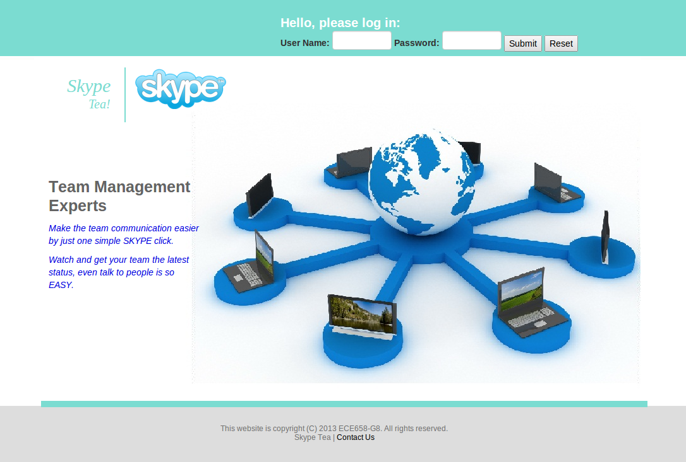

##SkypeTea

The target of this project is to develop an integrated web application for small team or group to easily manage their members’ status (such as on-site, travel, vacation)and assets’ status (such as on/off, under repair) and communicate with interesting member or assets’ person liable instantly.



This application is developed on top of Java EE framework.

This project is originally the group course project of ECE 658 at University of Waterloo. Group members include Bing Lu, Wanfei Liu and Chengpei Shi.

This project follows the procedure of the component-based software development. The program contains three components; two of them are self-developed and one is the off-the-shelf Microsoft Skype.


##Files in this repo
In this repository, the ```SkypeTea.zip``` is the whole project which is exported from NetBeans IDE. The project is ready to run after imported to NetBeans IDE. However, it won't be fully functional unless corresponding databases are created. The details of creating databases are included in the top comments of ```DBConnection.java```.
